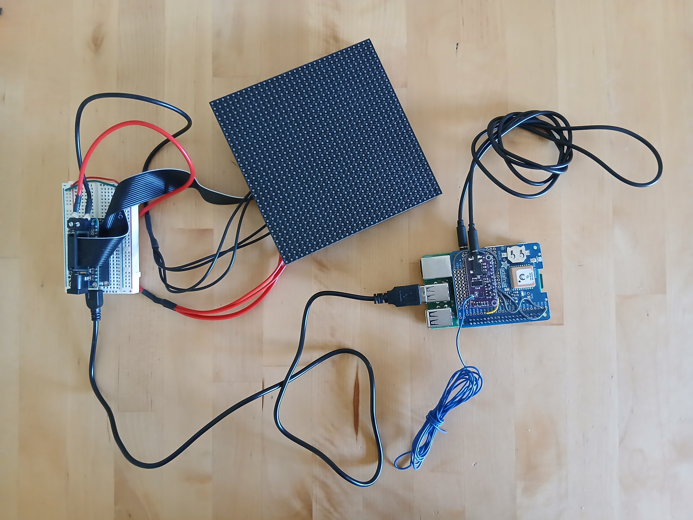

This is the hardware setup. 
- Raspberry Pi 3 Model B+ (3B+)
- SI4713 Stereo FM Transmitter Module
- Adafruit Ultimate GPS HAT for Raspberry Pi A+/B+/Pi 2 [ADA2324]
- Adafruit Feather M4 Express
- Adafruit RGB Matrix Featherwing Kit 
- Adafruit 32x32 RGB Matrix 
